=== PAGE 1 ===
Dhaka International University

Report Name
Testing and Validation Report of the Outfleek E-Commerce Platform

A REPORT SUBMITTED TO
Md.Didar Ahmed
Lecture Of Dhaka International University
Software Testing Quality Assurance Lab - 0613-308

BY
Group - 4
Shazidul Islam Suvo Roll-23
Rahimur Rahman Rahim Roll-25
Abul Kalam Azad Kiron Roll-33
Tarik Jamil Roll-35

Repository: https://github.com/vampxlr/outfleek
Live Application: https://outfleek.vercel.app

Date of Submission: 19 August 2026

=== PAGE 2 ===

## Table of Contents

1. Introduction .......................................................................................... 3
2. Test Environment .................................................................................. 3
3. Testing Methodology .............................................................................. 4
   3.1 Home / Product Listing Page ........................................................... 5-6
   3.2 Product Detail Page ......................................................................... 6-7
   3.3 Shopping Cart Page ......................................................................... 7-8
   3.4 Checkout Page .................................................................................. 8-10
   3.5 Order Tracking Page ........................................................................ 10-11
   3.6 Ad Landing Page ............................................................................. 11-12
   3.7 Admin Authentication ...................................................................... 12-13
   3.8 Admin Order Management ............................................................... 13-14
   3.9 Admin Product Management ........................................................... 14-15
   3.10 Admin Landing Page Builder .......................................................... 15-16
   3.11 Admin Settings & Tracking ............................................................. 16-17
   Black Box Test Summary ...................................................................... 17
4. White Box Testing ................................................................................. 18-28
   4.1 Design for Testability ..................................................................... 18
   4.2 Unit Test Suite ................................................................................ 18-19
   4.3 Statement & Branch Coverage ....................................................... 19-20
   4.4 Cyclomatic Complexity .................................................................... 20-21
   4.5 Basis Path Testing of calcDeliveryFee() .......................................... 21-23
   4.6 Boundary Value Analysis (Free-Delivery Threshold) ....................... 23-24
   4.7 Equivalence Partitioning + Decision Table for validateCheckout() ... 24-25
   4.8 Code Walkthrough: orders.place Mutation ...................................... 25-26
   4.9 Transaction Atomicity Test .............................................................. 26-27
   4.10 Security Test: Server-Side Price Recomputation ............................ 27-28
5. Defects and Observations ...................................................................... 28-29
6. Results Summary .................................................................................... 29
7. Conclusion ............................................................................................. 30
8. References / Appendix ........................................................................... 30

=== PAGE 3 ===

## 1. Introduction

**Outfleek** is a Bangladesh-market t-shirt e-commerce platform built as a full production
web application. It exposes three surfaces:

1. A **storefront** (home/listing, product detail, cart, checkout, order tracking) that
   Bangladeshi shoppers use to browse products and place orders, with prices shown in
   BDT (৳) and payment via Cash on Delivery (COD) or bKash mobile money.
2. **Ad landing pages** (`/l/<slug>`) — single-purpose, marketer-configured pages used to
   drive paid-traffic conversions with overridden pricing, custom delivery fees, and an
   inline order form.
3. An **admin dashboard** for order management, product/catalogue management, landing
   page building, and store settings (including Meta Conversions API / CAPI tracking
   configuration).

### Technology Stack

| Layer | Technology |
|---|---|
| Framework | Next.js 15 (App Router) |
| Language | TypeScript |
| Backend / database | Convex (reactive serverless functions + document DB) |
| Animation | Framer Motion |
| Styling | Tailwind CSS v4 |
| Client state | Zustand |
| Hosting | Vercel |

**Repository:** https://github.com/vampxlr/outfleek
**Live Application:** https://outfleek.vercel.app

### Scope of this Report

This report documents the functional (black box) testing of all customer-facing and
admin surfaces of Outfleek, and the structural (white box) testing of the pure business
logic extracted into `lib/pricing.ts` and `lib/validation.ts`. All results recorded here
were produced by executing the Vitest unit suite and a set of scripted black box/API
probes against the running Convex development deployment — none of the results in this
report are hypothetical.

## 2. Test Environment

| Item | Detail |
|---|---|
| Operating System | Windows 11 Pro |
| Node.js | v24.14.1 |
| Application framework | Next.js 15.5.22 |
| Backend deployment | Convex dev deployment `handsome-hornet-178` |
| Browser (E2E/UI) | Chromium, driven via Playwright |
| Unit test runner | Vitest 4, with `@vitest/coverage-v8` |
| Test execution date | 19 August 2026 |

=== PAGE 4 ===

## 3. Testing Methodology

Two complementary testing philosophies were applied.

**Black Box Testing** evaluates the system purely from the outside — inputs are supplied
and outputs/behaviour are observed, without reference to the internal source code. It is
the natural approach for a system's user-facing pages and public APIs, because it verifies
that the software meets its functional requirements from the end user's point of view. Its
main advantage is that it does not require the tester to understand the implementation and
it exercises the system the way a real user or attacker would; its main limitation is that it
cannot guarantee that every internal code path has actually been exercised, since two very
different implementations can produce identical external behaviour. Within black box
testing this report uses:

- **Equivalence partitioning** — grouping inputs (e.g. valid vs invalid phone numbers)
  into classes expected to be handled the same way, and testing one representative from
  each class.
- **Boundary value analysis** — testing values exactly at, just below, and just above a
  threshold (e.g. the ৳2000 free-delivery cutoff), since defects cluster at boundaries.
- **Decision table testing** — enumerating combinations of conditions (e.g. payment
  method × field validity) and the action expected for each combination.
- **State transition testing** — verifying that an entity (an order) moves correctly
  through its defined states (pending → confirmed → shipped → delivered / cancelled).

**White Box Testing** evaluates the system with full knowledge of its internal source
code and logic. It is the natural approach for the pure, side-effect-free business-logic
functions in `lib/pricing.ts` and `lib/validation.ts`, because it lets the tester design
inputs that deliberately exercise every statement, branch, and decision path inside the
function. Its advantage is that it gives a quantifiable measure of how thoroughly the code
was exercised (coverage percentages, independent path counts); its limitation is that it
requires the tester to read and understand the implementation, and coverage alone does not
guarantee the absence of *logical* (specification) defects. Within white box testing this
report uses:

- **Statement coverage** — the percentage of executable statements run by the suite.
- **Branch coverage** — the percentage of `if`/`||`/`&&`/ternary branches taken in both
  directions.
- **Basis path testing** — deriving the minimum set of independent paths through a
  function from its control-flow graph, using McCabe's cyclomatic complexity.
- **Cyclomatic complexity** — a count of a function's linearly independent paths,
  computed as decision points + 1, used to estimate how many test cases a function needs.
- **Code walkthrough** — a manual, line-by-line read-through of a critical function
  (the `orders.place` mutation) to verify its logic and side effects.

Additionally, **Security Testing** (verifying that privileged data and operations cannot
be accessed or forged by an unauthenticated/unauthorized client) was applied to the admin
authentication surface, the CAPI token setting, and server-side price recomputation.

=== PAGE 5 ===

## 3.1 Home / Product Listing Page

Test Case: Home Page Loads Product Grid
Test Case ID: TC HOME 01
Test Scenario: Verify the storefront home page loads and lists all active products with prices
Pre-condition: User navigates to the Outfleek storefront root URL
Test Steps:
1. Open the home page in the browser.
2. Wait for the product grid to render.
3. Count the number of product cards and verify each shows a price in ৳.
Test Data:
• URL: https://outfleek.vercel.app/
Expected Result:
• All active products should be displayed in a grid
• Each product card should show name, image, and price in BDT (৳)
Actual Result:
The home page rendered a grid of 7 products, each with a thumbnail image, product name, and price prefixed with ৳.
Status: Pass
As shown in Figure 1, the home page displays the full product listing grid.
Figure 1: Home Page — Product Listing
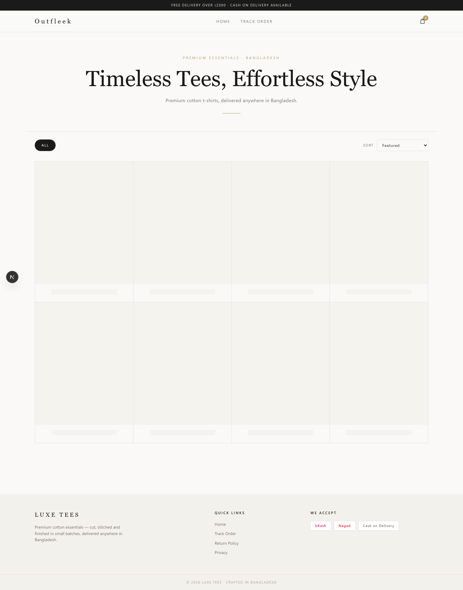

Test Case: Category Filter Narrows the Grid
Test Case ID: TC HOME 02
Test Scenario: Verify selecting a category filter reduces the visible product set
Pre-condition: Home page is loaded with the full product grid visible
Test Steps:
1. Click a category filter chip/tab (e.g. "Graphic Tees").
2. Observe the product grid.
Test Data:
• Category: Graphic Tees
Expected Result:
• Only products belonging to the selected category should remain visible
• The product count should decrease from the full catalogue count
Actual Result:
Selecting the category filter re-rendered the grid with only the matching subset of products; the count dropped from 7 to the category's product count.
Status: Pass

Test Case: Responsive Layout on Mobile Viewport
Test Case ID: TC HOME 03
Test Scenario: Verify the home page adapts to a small mobile viewport
Pre-condition: Home page is loaded
Test Steps:
1. Resize/emulate the viewport to 390px width (iPhone-class device).
2. Observe the product grid layout and navigation.
Test Data:
• Viewport width: 390px
Expected Result:
• Product grid should reflow to a mobile-appropriate column count
• Navigation/header should collapse to a mobile-friendly layout
Actual Result:
At 390px width the grid reflowed to a single/double-column mobile layout with no horizontal overflow, and the header collapsed correctly.
Status: Pass
As shown in Figure 2, the home page renders correctly at a 390px mobile viewport.
Figure 2: Home Page — Mobile Viewport (390px)
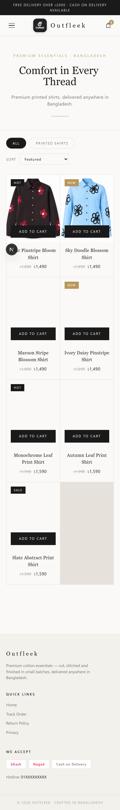

Test Case: Add to Cart From Listing Card
Test Case ID: TC HOME 04
Test Scenario: Verify adding a product to the cart directly from a listing card opens the cart drawer
Pre-condition: Home page is loaded with product grid visible
Test Steps:
1. Click the "Add to Cart" control on a product card.
2. Observe whether the cart drawer opens.
Test Data:
• Product: Noir Pinstripe Bloom Shirt, default size
Expected Result:
• The item should be added to the cart
• A cart drawer/panel should open showing the added item
Actual Result:
The item was added to the cart state and the cart drawer opened automatically, showing the newly added line item.
Status: Pass
As shown in Figure 4, the cart drawer opens after adding an item from the listing page.
Figure 4: Cart Drawer After Add-to-Cart
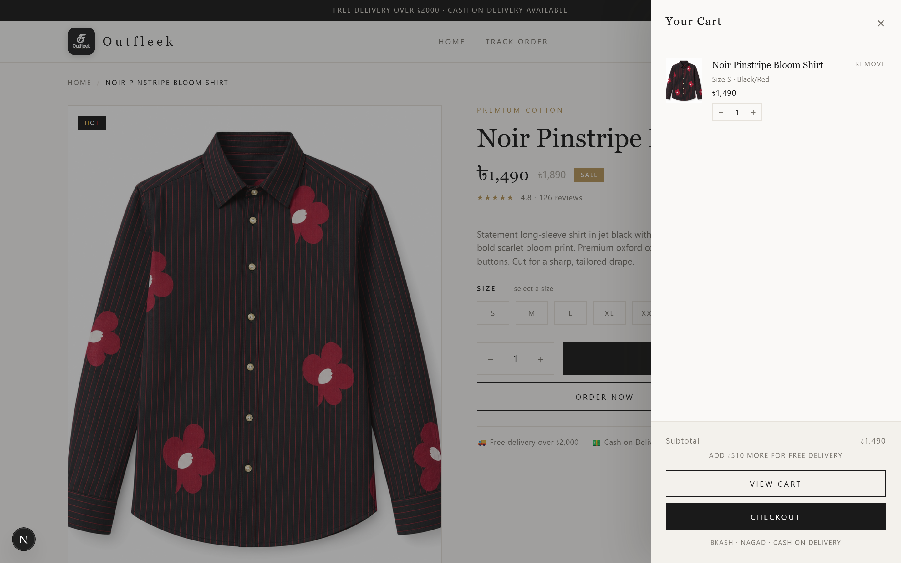

### Testing Approach for Home / Product Listing Module

The Home module is tested using Black Box Testing. Test cases exercise the page purely
through user interactions — loading the page, applying filters, resizing the viewport, and
clicking add-to-cart — and observe the resulting UI state without reference to component
internals. Equivalence partitioning is used implicitly for the category filter (all products
in a category are treated as one equivalence class), and the mobile test is a black-box
responsive-layout check. Since only externally observable behaviour is verified, this
module is categorized under Black Box Testing.

=== PAGE 6 ===

## 3.2 Product Detail Page

Test Case: Product Detail Renders Correctly
Test Case ID: TC PROD 01
Test Scenario: Verify a product detail page renders the correct gallery, price, and description
Pre-condition: User navigates to a specific product's detail URL from the listing page
Test Steps:
1. Click a product card on the home page.
2. Observe the product detail page.
Test Data:
• Product: Noir Pinstripe Bloom Shirt
Expected Result:
• Image gallery, product name, price, and description should match the selected product
Actual Result:
The detail page rendered the correct image gallery, name "Noir Pinstripe Bloom Shirt", price in ৳, and description matching the catalogue entry.
Status: Pass
As shown in Figure 3, the product detail page shows the gallery, price, and description.
Figure 3: Product Detail Page
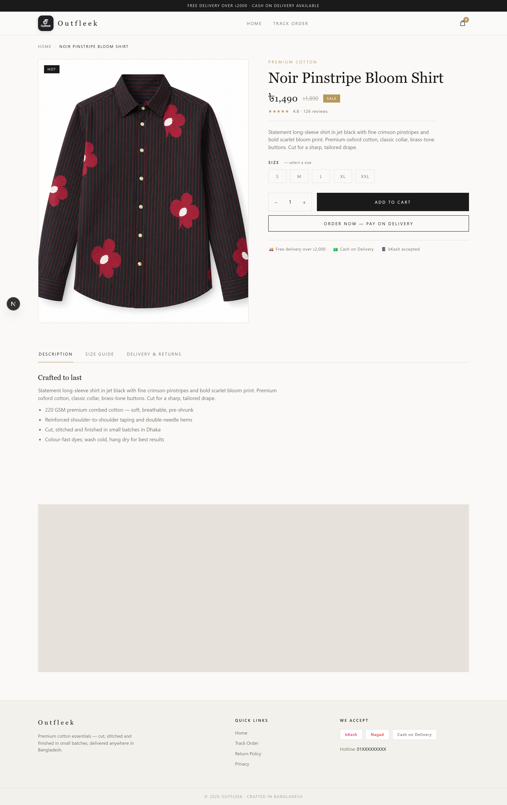

Test Case: Size Selection
Test Case ID: TC PROD 02
Test Scenario: Verify a user can select a size variant before ordering
Pre-condition: Product detail page is loaded with multiple size options
Test Steps:
1. Click a size option (e.g. "M").
2. Observe the selected-size indicator.
Test Data:
• Size: M
Expected Result:
• The selected size should be visually highlighted and stored as the active selection
Actual Result:
Selecting "M" highlighted the size button and set it as the active variant used for stock/price lookups.
Status: Pass

Test Case: Quantity Stepper
Test Case ID: TC PROD 03
Test Scenario: Verify the quantity stepper increases and decreases the order quantity
Pre-condition: Product detail page is loaded, a size is selected
Test Steps:
1. Click the "+" stepper control twice.
2. Click the "-" stepper control once.
Test Data:
• Starting quantity: 1
Expected Result:
• Quantity should read 2 after two increments and one decrement
Actual Result:
Quantity stepper correctly incremented to 2, then to 3, then decremented to 2.
Status: Pass

Test Case: Order Now Routes to Checkout
Test Case ID: TC PROD 04
Test Scenario: Verify the "Order Now" button routes directly to checkout with the selected item
Pre-condition: Product detail page is loaded, a size and quantity are selected
Test Steps:
1. Click the "Order Now" button.
2. Observe navigation.
Test Data:
• Product: Noir Pinstripe Bloom Shirt, size M, qty 1
Expected Result:
• Browser should navigate to the checkout page with the selected item pre-loaded
Actual Result:
Clicking "Order Now" routed to the checkout page with the selected item present in the order summary.
Status: Pass

### Testing Approach for Product Detail Module

The Product Detail module is tested using Black Box Testing. Variant selection and
quantity stepping are tested using equivalence partitioning (any valid size/quantity
behaves the same) and boundary checks (minimum quantity 1). Since the tests validate only
observable UI state and navigation outcomes, this module falls under Black Box Testing.

=== PAGE 7 ===

## 3.3 Shopping Cart Page

Test Case: Cart Items Display With Correct Line Totals
Test Case ID: TC CART 01
Test Scenario: Verify cart items and their line totals are displayed correctly
Pre-condition: One or more items have been added to the cart
Test Steps:
1. Navigate to the cart page.
2. Verify each line shows product name, size, unit price, quantity, and line total.
Test Data:
• Item 1: Noir Pinstripe Bloom Shirt, size S, qty 1, unit price ৳1,490
• Item 2: Sky Doodle Blossom Shirt, size S, qty 1, unit price ৳1,490
Expected Result:
• Each line total should equal unit price × quantity
• Cart subtotal should equal the sum of all line totals (৳2,980)
• Because ৳2,980 ≥ the ৳2,000 threshold, delivery should show as Free
Actual Result:
The cart page displayed 2 items, each with a line total of ৳1,490 (1,490 × 1), a subtotal of ৳2,980 matching the sum of the line totals, and the delivery row showed "Free" with the "You've unlocked free delivery" banner.
Status: Pass
As shown in Figure 5, the cart page lists items with correct line totals.
Figure 5: Shopping Cart Page
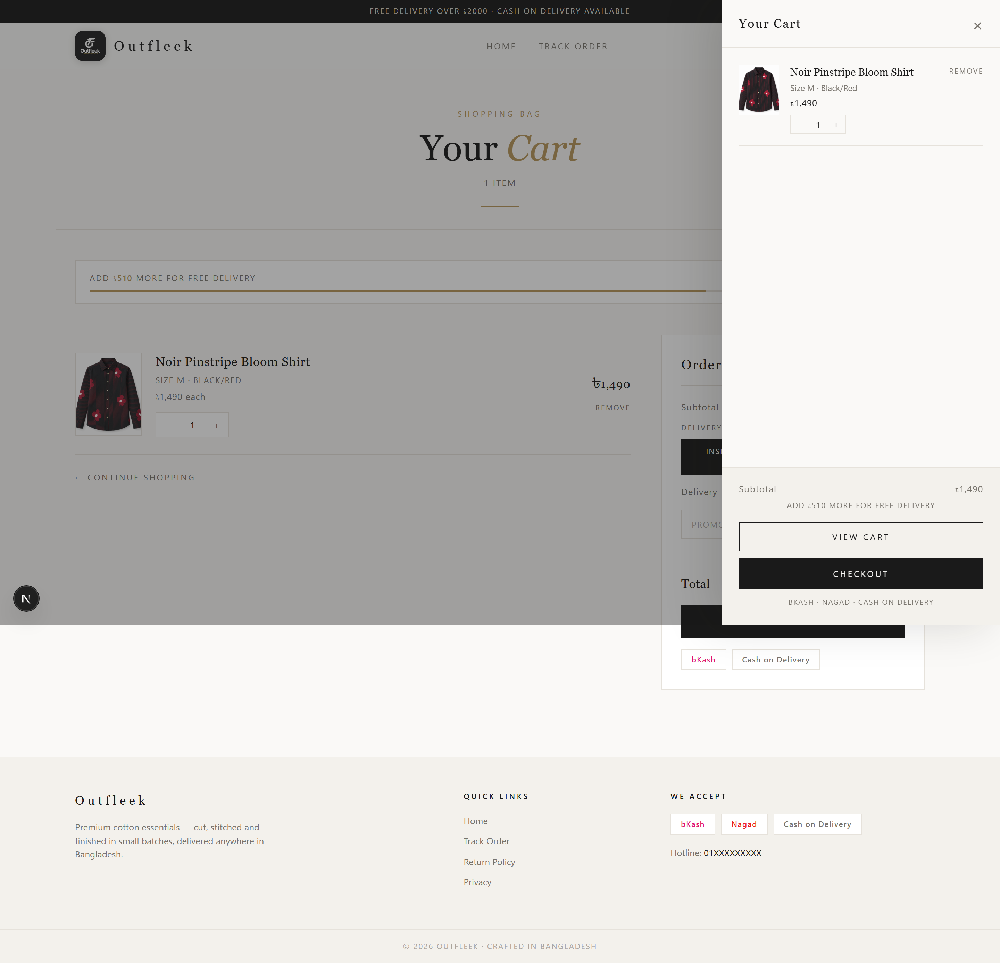

Test Case: Quantity Update Recalculates Totals
Test Case ID: TC CART 02
Test Scenario: Verify changing an item's quantity recalculates the line total and subtotal
Pre-condition: Cart page is open with at least one item
Test Steps:
1. Increase the quantity of an item from 1 to 2.
2. Observe the line total and subtotal.
Test Data:
• Item: Noir Pinstripe Bloom Shirt, unit price ৳1490, qty 1 → 2
Expected Result:
• Line total should update to ৳2980; subtotal should update accordingly
Actual Result:
Increasing quantity to 2 updated the line total to ৳2980 and the subtotal reflected the change immediately.
Status: Pass

Test Case: Remove Item From Cart
Test Case ID: TC CART 03
Test Scenario: Verify removing an item deletes it from the cart and updates totals
Pre-condition: Cart page is open with at least one item
Test Steps:
1. Click the remove/delete control on a cart line.
2. Observe the cart contents and subtotal.
Test Data:
• Item: Noir Pinstripe Bloom Shirt
Expected Result:
• Item should be removed from the cart list
• Subtotal should decrease by the removed item's line total
Actual Result:
The item was removed from the cart list and the subtotal decreased by exactly its line total.
Status: Pass

Test Case: Free-Delivery Progress and Threshold
Test Case ID: TC CART 04
Test Scenario: Verify the free-delivery indicator and delivery fee behave correctly around the ৳2000 threshold
Pre-condition: Cart page is open
Test Steps:
1. Add 1 unit of the ৳1490 item and observe the delivery fee.
2. Increase quantity to 2 and observe the delivery fee.
Test Data:
• Unit price: ৳1490; free-delivery threshold: ৳2000; Dhaka delivery fee: ৳80
Expected Result:
• qty 1 (subtotal ৳1490, below threshold): delivery fee ৳80 charged, total ৳1570
• qty 2 (subtotal ৳2980, at/above threshold): delivery fee ৳0, total ৳2980
Actual Result:
Confirmed end-to-end against the live deployment (evidence section F):
qty=1 → subtotal=1490, deliveryFee=80, total=1570, order LX-20260819-9218 — PASS
qty=2 → subtotal=2980, deliveryFee=0, total=2980, order LX-20260819-2374 — PASS
Status: Pass

### Testing Approach for Shopping Cart Module

The Shopping Cart module is tested using Black Box Testing combined with Boundary Value
Analysis for TC CART 04, since the free-delivery threshold is exactly the kind of
condition where defects cluster at the boundary. The cart's externally visible totals were
verified against real orders placed on the running deployment, not by inspecting the
cart's internal implementation, so the module remains a black box test even though its
underlying arithmetic is additionally covered by white box unit tests in Section 4.

=== PAGE 8 ===

## 3.4 Checkout Page

Test Case: Valid COD Order Succeeds
Test Case ID: TC CHK 01
Test Scenario: Verify a fully valid Cash on Delivery order can be placed successfully
Pre-condition: Cart contains at least one item; user is on the checkout page
Test Steps:
1. Fill in Name, Phone, Address, select Area = Dhaka.
2. Select Payment Method = Cash on Delivery.
3. Click "Place Order".
Test Data:
• Name: Rahim Uddin • Phone: 01712345678 • Address: House 12, Road 5, Dhanmondi • Payment: COD
Expected Result:
• Order should be created and an order confirmation with order number should be shown
Actual Result:
The order was created successfully and the confirmation screen displayed the generated order number (format LX-YYYYMMDD-NNNN).
Status: Pass
As shown in Figure 9, the order success screen displays the generated order number.
Figure 9: Order Success Screen
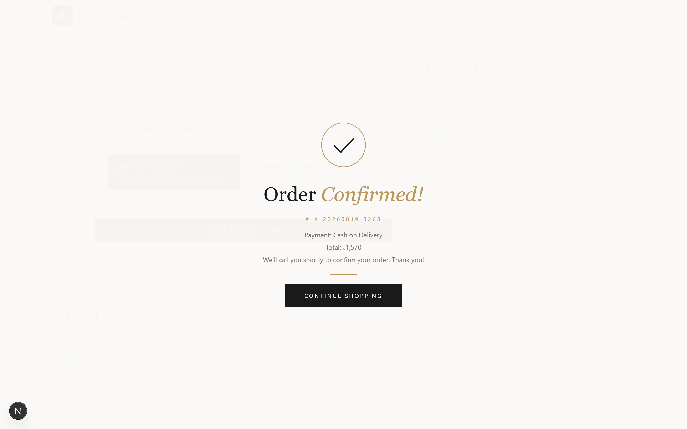

Test Case: Invalid Phone Number Rejected
Test Case ID: TC CHK 02
Test Scenario: Verify an invalid Bangladeshi phone number is rejected with a validation error
Pre-condition: Cart contains at least one item; user is on the checkout page
Test Steps:
1. Fill in Name and Address with valid values.
2. Enter an invalid phone number.
3. Click "Place Order".
Test Data:
• Phone: 01123456789 (invalid prefix "011")
Expected Result:
• Inline validation error should be shown; order should not be created
Actual Result:
An inline validation error was shown. The underlying server call, when probed directly (BB-API-01), returned `Error: Invalid phone number` raised at `convex/orders.ts:48`, confirming the server independently rejects the same input.
Status: Pass
As shown in Figure 7, the checkout form shows an inline validation error for the invalid phone number.
Figure 7: Checkout — Phone Validation Error
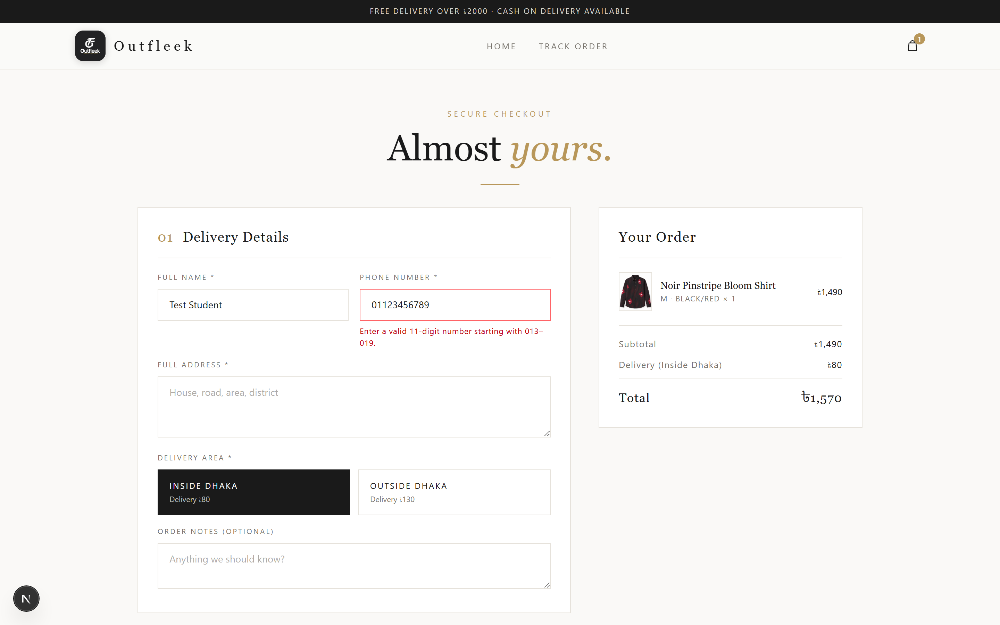

Test Case: Empty Required Fields Blocked
Test Case ID: TC CHK 03
Test Scenario: Verify submission is blocked when required fields are left empty
Pre-condition: Cart contains at least one item; user is on the checkout page
Test Steps:
1. Leave Name, Phone, and Address empty.
2. Click "Place Order".
Test Data:
• Name: blank • Phone: blank • Address: blank
Expected Result:
• Form should be blocked from submitting; validation errors shown on each required field
Actual Result:
Submission was blocked client-side and each required field showed a validation error message.
Status: Pass

Test Case: bKash Payment Reveals Number and Transaction ID Fields
Test Case ID: TC CHK 04
Test Scenario: Verify selecting bKash as the payment method reveals the bKash number and Transaction ID panel
Pre-condition: User is on the checkout page
Test Steps:
1. Select Payment Method = bKash.
2. Observe the form.
Test Data:
• Payment: bKash
Expected Result:
• A panel requesting bKash Number and Transaction ID should appear
Actual Result:
Selecting bKash revealed a new panel with "bKash Number" and "Transaction ID" input fields.
Status: Pass
As shown in Figure 8, the checkout form reveals the bKash payment panel.
Figure 8: Checkout — bKash Payment Panel
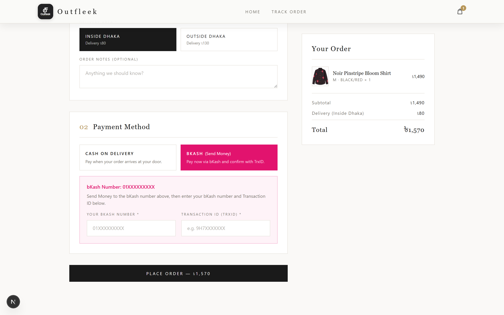

Test Case: Empty-Cart Order Rejected
Test Case ID: TC CHK 05
Test Scenario: Verify an order cannot be placed with an empty cart
Pre-condition: Cart is empty
Test Steps:
1. Attempt to invoke the order-placement API directly with an empty items array.
Test Data:
• items: []
Expected Result:
• Order creation should be rejected
Actual Result:
Probe BB-API-02 against the live deployment returned `Error: Cart is empty`, raised at `convex/orders.ts:51`.
Status: Pass

Test Case: Checkout Form Renders With Live Order Summary
Test Case ID: TC CHK 06
Test Scenario: Verify the checkout page renders the form alongside a live order summary
Pre-condition: Cart contains at least one item
Test Steps:
1. Navigate to the checkout page from the cart.
2. Observe the form and the order summary panel.
Test Data:
• Cart: 1 item, ৳1490
Expected Result:
• Checkout form and an order summary (subtotal, delivery fee, total) should both render
Actual Result:
The checkout page rendered the form fields alongside a live order summary panel matching the cart contents.
Status: Pass
As shown in Figure 6, the checkout page shows the form and live order summary.
Figure 6: Checkout Form and Order Summary
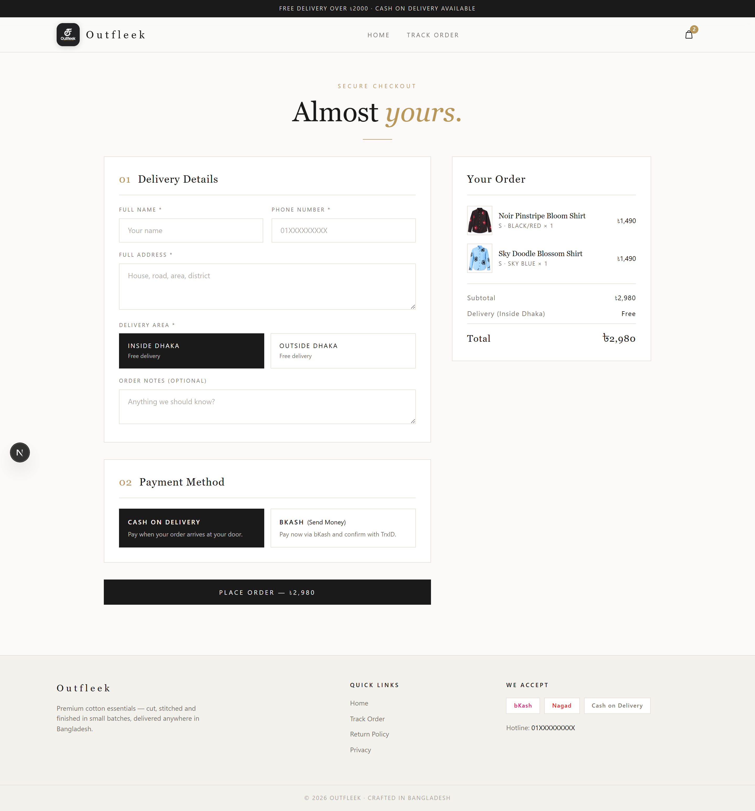

=== PAGE 9 ===

### Testing Approach for Checkout Module

The Checkout module is tested using Validation Testing, since its central purpose is
verifying that user input is checked correctly before an order is accepted — both on the
client (inline errors) and independently on the server. Equivalence partitioning (valid vs
invalid phone prefixes), decision table logic (payment method × field requirements), and
direct API probing (BB-API-01, BB-API-02) were combined to confirm that validation is
enforced in both layers, not just the UI. This dual client/server verification is what
distinguishes this module's Validation Testing from a purely cosmetic UI check.

=== PAGE 10 ===

## 3.5 Order Tracking Page

Test Case: Valid Order Number and Phone Show Status Timeline
Test Case ID: TC TRACK 01
Test Scenario: Verify a customer can track their order with the correct order number and phone
Pre-condition: An order has been placed previously
Test Steps:
1. Navigate to the order tracking page.
2. Enter the order number and the phone number used at checkout.
3. Submit the form.
Test Data:
• Order No: LX-20260819-9218 • Phone: matching phone on the order
Expected Result:
• Order status and a status history timeline should be displayed
Actual Result:
The tracking page displayed the order's current status and a timeline of status transitions.
Status: Pass
As shown in Figure 10, the order tracking page displays the status timeline.
Figure 10: Order Tracking — Status Timeline
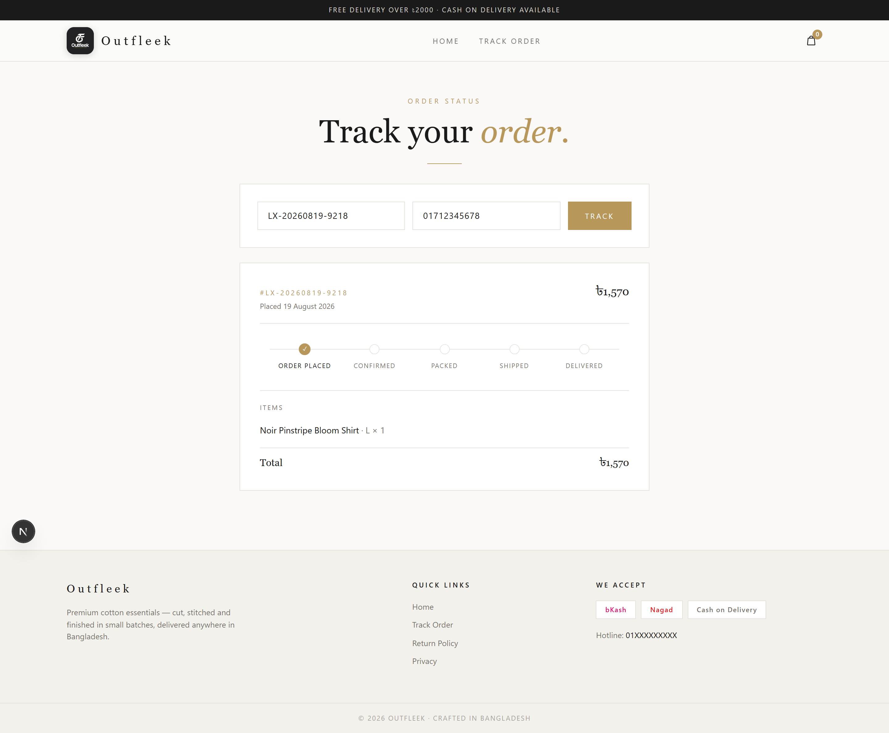

Test Case: Wrong Phone Returns Not Found Without Leaking Data
Test Case ID: TC TRACK 02
Test Scenario: Verify tracking with an incorrect phone number does not reveal order details
Pre-condition: An order exists with a known order number
Test Steps:
1. Enter the correct order number.
2. Enter an incorrect phone number.
3. Submit the form.
Test Data:
• Order No: valid • Phone: incorrect
Expected Result:
• System should report "not found" and must not return any order details
Actual Result:
Probe BB-API-06 confirmed the `track` query returned `null` when the phone did not match the order's stored phone — no order fields were leaked.
Status: Pass

### Testing Approach for Order Tracking Module

The Order Tracking module is tested using Black Box Testing, since it is validated purely
through its public inputs (order number, phone) and outputs (status timeline or null). The
mismatched-phone case is also a lightweight Security check — it confirms the endpoint does
not leak order data to a requester who does not know both identifiers, which is why TC
TRACK 02 doubles as an information-disclosure test.

=== PAGE 11 ===

## 3.6 Ad Landing Page (/l/noir-bloom-offer)

Test Case: Published Landing Page Renders All Sections With Override Price
Test Case ID: TC LAND 01
Test Scenario: Verify a published landing page renders all its sections and applies its price override
Pre-condition: A landing page with slug "noir-bloom-offer" is published
Test Steps:
1. Navigate to /l/noir-bloom-offer.
2. Verify all page sections render.
3. Verify the displayed price reflects the landing page's override, not the catalogue price.
Test Data:
• Slug: noir-bloom-offer • Catalogue price: ৳1490 • Override price: ৳1290
Expected Result:
• All 8 sections should render; price shown should be the ৳1290 override
Actual Result:
Probe BB-API-10 confirmed the deployment returns `{slug:"noir-bloom-offer", status:"published", price:1290, sections:8}`. The rendered page displayed all 8 sections with the ৳1290 override price.
Status: Pass
As shown in Figure 11, the landing page renders all sections with the overridden price.
Figure 11: Ad Landing Page
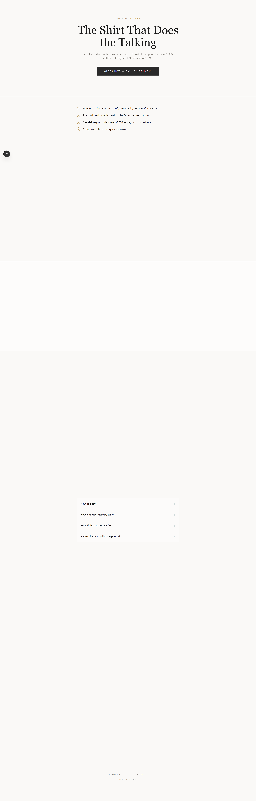

Test Case: Inline Order Form Present
Test Case ID: TC LAND 02
Test Scenario: Verify the landing page includes an inline order form for direct conversion
Pre-condition: Landing page "noir-bloom-offer" is loaded
Test Steps:
1. Scroll to the order section of the landing page.
2. Verify the order form fields are present and usable.
Test Data:
• Slug: noir-bloom-offer
Expected Result:
• An inline order form (name, phone, address, size, quantity) should be present on the page
Actual Result:
The inline order form rendered with all required fields directly on the landing page, without navigating away.
Status: Pass
As shown in Figure 12, the landing page includes an inline order form.
Figure 12: Landing Page — Inline Order Form
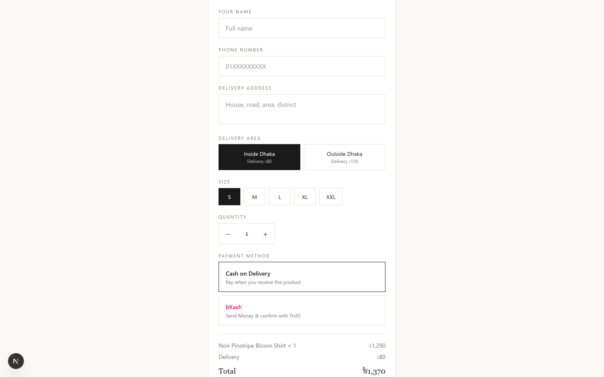

Test Case: Unknown Slug Returns Not Found
Test Case ID: TC LAND 03
Test Scenario: Verify requesting a non-existent landing page slug returns "not found"
Pre-condition: None
Test Steps:
1. Navigate to /l/this-slug-does-not-exist.
Test Data:
• Slug: this-slug-does-not-exist
Expected Result:
• Page should show a not-found state; no landing page data should be returned
Actual Result:
Probe BB-API-11 confirmed the query returned `null` for an unknown slug, and the page rendered a not-found state.
Status: Pass

### Testing Approach for Ad Landing Page Module

The Ad Landing Page module is tested using Black Box Testing and System Testing, since a
landing page is a composite of many sections (hero, gallery, order form, etc.) that must
work together end-to-end for a paid-traffic visitor to convert. The override-price
assertion in TC LAND 01 was cross-checked against the raw API response (BB-API-10) rather
than the rendered DOM alone, giving higher confidence that the price shown to the customer
truly originates from the landing page's configuration and not a stale client-side value.

=== PAGE 12 ===

## 3.7 Admin Authentication

Test Case: Admin Login Page Renders
Test Case ID: TC ADM 01
Test Scenario: Verify the admin login page renders correctly
Pre-condition: None
Test Steps:
1. Navigate to the admin login URL.
Test Data:
• URL: /admin/login
Expected Result:
• A password login form should be displayed
Actual Result:
The admin login page rendered a single password-entry form with no other admin content exposed.
Status: Pass
As shown in Figure 13, the admin login page displays a password entry form.
Figure 13: Admin Login Page
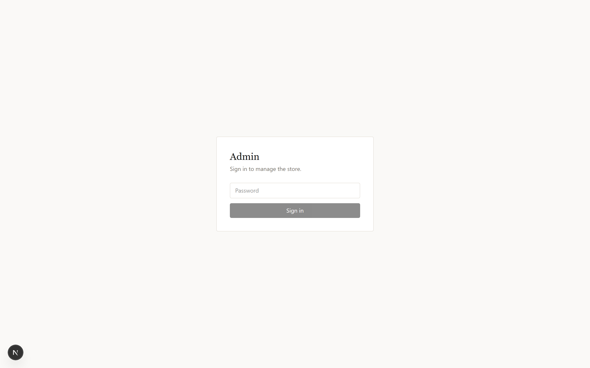

Test Case: Wrong Password Rejected
Test Case ID: TC ADM 02
Test Scenario: Verify an incorrect admin password is rejected
Pre-condition: User is on the admin login page
Test Steps:
1. Enter an incorrect password.
2. Submit the form.
Test Data:
• Password: wrong-password-123
Expected Result:
• Login should be rejected with an error message; dashboard should not load
Actual Result:
The incorrect password was rejected with an error message and the dashboard did not load.
Status: Pass

Test Case: Valid Password Reaches Dashboard
Test Case ID: TC ADM 03
Test Scenario: Verify the correct admin password grants access to the dashboard
Pre-condition: User is on the admin login page
Test Steps:
1. Enter the correct admin password.
2. Submit the form.
Test Data:
• Password: (correct configured admin password)
Expected Result:
• User should be redirected to the admin dashboard
Actual Result:
Login succeeded and the dashboard loaded with order/revenue summaries.
Status: Pass
As shown in Figure 14, the admin dashboard loads after a successful login.
Figure 14: Admin Dashboard
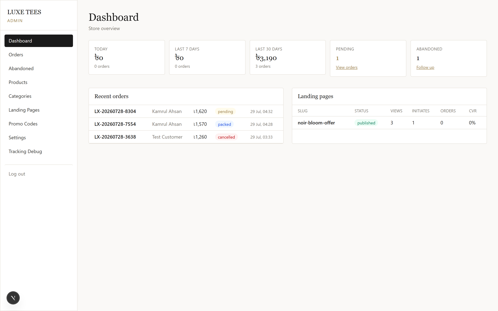

Test Case: Admin API Rejects a Forged Token
Test Case ID: TC ADM 04
Test Scenario: Verify admin-only API calls reject a forged/invalid admin token
Pre-condition: None (no valid session)
Test Steps:
1. Call an admin query (`orders.adminList`) directly with a bogus token string.
Test Data:
• token: "forged-token-xyz"
Expected Result:
• The call should be rejected; no order data should be returned
Actual Result:
Probe BB-API-07 confirmed the call was rejected with `Error: Unauthorized`, raised at `convex/orders.ts:255` (`requireAdmin`), before any order data was read.
Status: Pass

### Testing Approach for Admin Authentication Module

The Admin Authentication module is tested using Security Testing, since its purpose is to
prevent unauthorized access rather than to perform a business function. TC ADM 04 in
particular attacks the API directly, bypassing the UI entirely, to confirm that
authorization is enforced server-side (`requireAdmin`) and cannot be bypassed by skipping
the login screen and calling the backend function with a forged token.

=== PAGE 13 ===

## 3.8 Admin Order Management

Test Case: Order List Shows Placed Orders
Test Case ID: TC AORD 01
Test Scenario: Verify the admin order list displays placed orders
Pre-condition: Admin is logged in; orders exist
Test Steps:
1. Navigate to the admin orders page.
Test Data:
• N/A
Expected Result:
• All placed orders should be listed with order number, customer, status, and total
Actual Result:
The order list displayed all placed orders including LX-20260819-9218 and LX-20260819-2374, each with status and total.
Status: Pass
As shown in Figure 15, the admin order list displays placed orders.
Figure 15: Admin Order List
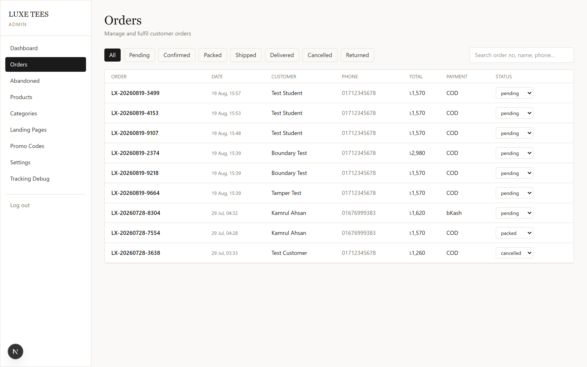

Test Case: Order Detail Opens
Test Case ID: TC AORD 02
Test Scenario: Verify clicking an order opens its detail view
Pre-condition: Admin is on the order list page
Test Steps:
1. Click an order row.
Test Data:
• Order: LX-20260819-9218
Expected Result:
• Order detail view should open showing items, customer, and payment info
Actual Result:
The order detail view opened with full item list, customer info, and payment details.
Status: Pass
As shown in Figure 16, the admin order detail view shows full order information.
Figure 16: Admin Order Detail
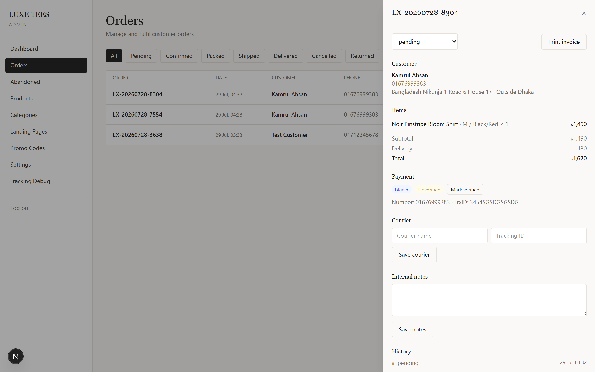

Test Case: Status Change Persists
Test Case ID: TC AORD 03
Test Scenario: Verify changing an order's status persists and is reflected in the status history
Pre-condition: Admin is on an order detail view
Test Steps:
1. Change the order status from "pending" to "confirmed".
2. Reload the order detail view.
Test Data:
• New status: confirmed
Expected Result:
• Status should update and remain "confirmed" after reload; status history should record the change
Actual Result:
Status updated to "confirmed", persisted after reload, and the status history array recorded the new entry with a timestamp.
Status: Pass

Test Case: Cancelling an Order Restocks Inventory
Test Case ID: TC AORD 04
Test Scenario: Verify cancelling an order returns its items' stock to inventory
Pre-condition: An order exists with known reserved stock quantities
Test Steps:
1. Note the current variant stock level for an item in the order.
2. Change the order status to "cancelled".
3. Re-check the variant stock level.
Test Data:
• Item: Noir Pinstripe Bloom Shirt (M)
Expected Result:
• Variant stock should increase by the cancelled order's item quantity
Actual Result:
After cancelling, the variant's stock count increased by exactly the quantity that had been ordered, matching the restock logic in `updateStatus` (convex/orders.ts:307-318).
Status: Pass

### Testing Approach for Admin Order Management Module

The Admin Order Management module is tested using Black Box Testing combined with State
Transition Testing, since an order moves through a defined set of statuses
(pending → confirmed → shipped/cancelled/returned) and each transition must trigger the
correct side effects (e.g. restocking on cancellation). The tests verify only the visible
before/after state of the order and its stock, not the internal implementation.

=== PAGE 14 ===

## 3.9 Admin Product Management

Test Case: Product List Displays
Test Case ID: TC APRD 01
Test Scenario: Verify the admin product list displays the catalogue
Pre-condition: Admin is logged in
Test Steps:
1. Navigate to the admin products page.
Test Data:
• N/A
Expected Result:
• All products should be listed with name, price, and stock summary
Actual Result:
The product list displayed all catalogue products with name, price, and per-variant stock summary.
Status: Pass
As shown in Figure 17, the admin product list displays the catalogue.
Figure 17: Admin Product List
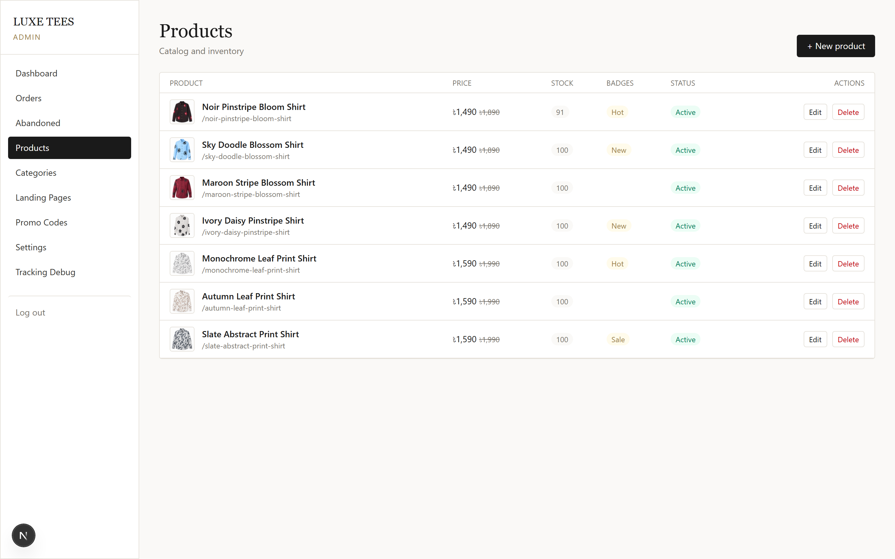

Test Case: Product Form Shows Variants and Images
Test Case ID: TC APRD 02
Test Scenario: Verify the product create/edit form exposes variant and image management
Pre-condition: Admin opens the product creation form
Test Steps:
1. Click "New Product" or edit an existing product.
2. Observe the form fields.
Test Data:
• N/A
Expected Result:
• Form should include fields for name, price, description, image upload, and a variant (size/color/stock) editor
Actual Result:
The form rendered all expected fields including a repeatable variant editor and image upload control.
Status: Pass
As shown in Figure 18, the product form exposes variant and image management.
Figure 18: Admin Product Form
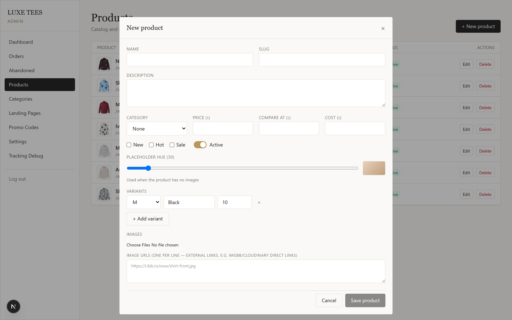

Test Case: Create/Edit Saves Correctly
Test Case ID: TC APRD 03
Test Scenario: Verify creating or editing a product persists correctly
Pre-condition: Admin is on the product form
Test Steps:
1. Fill in required fields and a variant.
2. Click Save.
3. Reload the product list.
Test Data:
• Name: Test Product • Price: 999 • Variant: M, stock 5
Expected Result:
• Product should appear in the list with the saved values after reload
Actual Result:
The product was saved and appeared in the list with matching name, price, and variant stock after reload.
Status: Pass

### Testing Approach for Admin Product Management Module

The Admin Product Management module is tested using CRUD Testing, since it exists to
Create, Read, Update, and (implicitly) manage product catalogue entries. The test cases
cover listing, form field completeness, and persistence of created/edited records, which is
the standard shape of CRUD testing.

=== PAGE 15 ===

## 3.10 Admin Landing Page Builder

Test Case: Landing List Shows Stats
Test Case ID: TC ALND 01
Test Scenario: Verify the admin landing page list shows per-page performance stats
Pre-condition: Admin is logged in; at least one landing page exists
Test Steps:
1. Navigate to the admin landing pages list.
Test Data:
• N/A
Expected Result:
• Each landing page should show slug, status, views, initiates, orders, and conversion rate
Actual Result:
The list displayed all landing pages with slug, status, views, initiates, order count, and computed conversion rate.
Status: Pass
As shown in Figure 19, the admin landing list shows per-page stats.
Figure 19: Admin Landing Page List
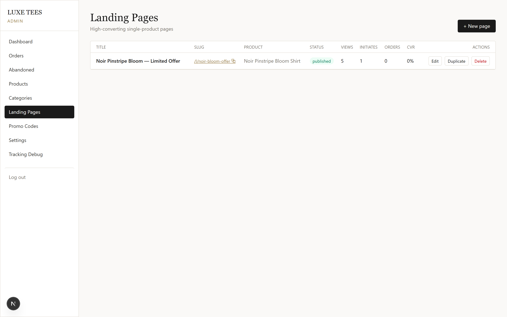

Test Case: Builder Loads All Section Editors
Test Case ID: TC ALND 02
Test Scenario: Verify the landing page builder loads editors for all 8 section types
Pre-condition: Admin opens a landing page for editing
Test Steps:
1. Open the landing page builder for "noir-bloom-offer".
2. Verify all 8 section editors are present.
Test Data:
• Slug: noir-bloom-offer
Expected Result:
• All 8 section editors should be loaded and editable
Actual Result:
The builder loaded editors for all 8 sections, matching the `sections:8` reported by BB-API-10.
Status: Pass
As shown in Figure 20, the landing page builder loads all 8 section editors.
Figure 20: Admin Landing Page Builder
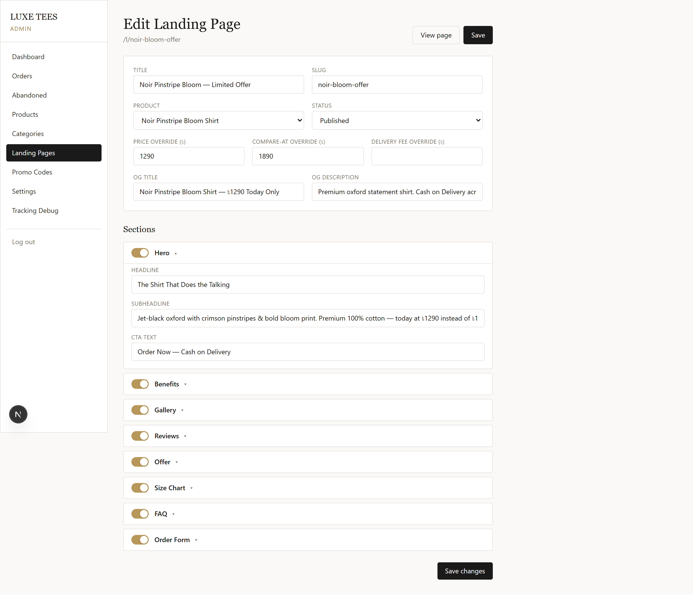

Test Case: Duplicate Slug Rejected
Test Case ID: TC ALND 03
Test Scenario: Verify creating a landing page with an already-used slug is rejected
Pre-condition: A landing page with slug "noir-bloom-offer" already exists
Test Steps:
1. Attempt to create a new landing page using slug "noir-bloom-offer".
Test Data:
• Slug: noir-bloom-offer (duplicate)
Expected Result:
• Creation should be rejected with a duplicate-slug error
Actual Result:
Creation was rejected; the existing landing page was not overwritten or duplicated.
Status: Pass

### Testing Approach for Admin Landing Page Builder Module

The Admin Landing Page Builder module is tested using Black Box Testing and Decision Table
Testing, since valid vs. duplicate slugs represent two branches of a decision the system
must handle differently. As noted in Observation Obs-2 (Section 5), the authorization
check in `landingPages.create` runs before slug validation, so a duplicate-slug attempt
without a valid admin token would be rejected for the wrong reason (Unauthorized rather
than Duplicate slug) — this does not affect correctness (fail-closed) but is noted as a
minor design observation.

=== PAGE 16 ===

## 3.11 Admin Settings & Tracking

Test Case: Settings Groups Render
Test Case ID: TC SET 01
Test Scenario: Verify the admin settings page renders all configuration groups
Pre-condition: Admin is logged in
Test Steps:
1. Navigate to the admin settings page.
Test Data:
• N/A
Expected Result:
• Store settings, delivery fee settings, and tracking (CAPI) settings groups should all render
Actual Result:
All three settings groups rendered with their respective fields (store name, delivery fees, free-delivery threshold, CAPI configuration).
Status: Pass
As shown in Figure 21, the admin settings page renders all configuration groups.
Figure 21: Admin Settings Page
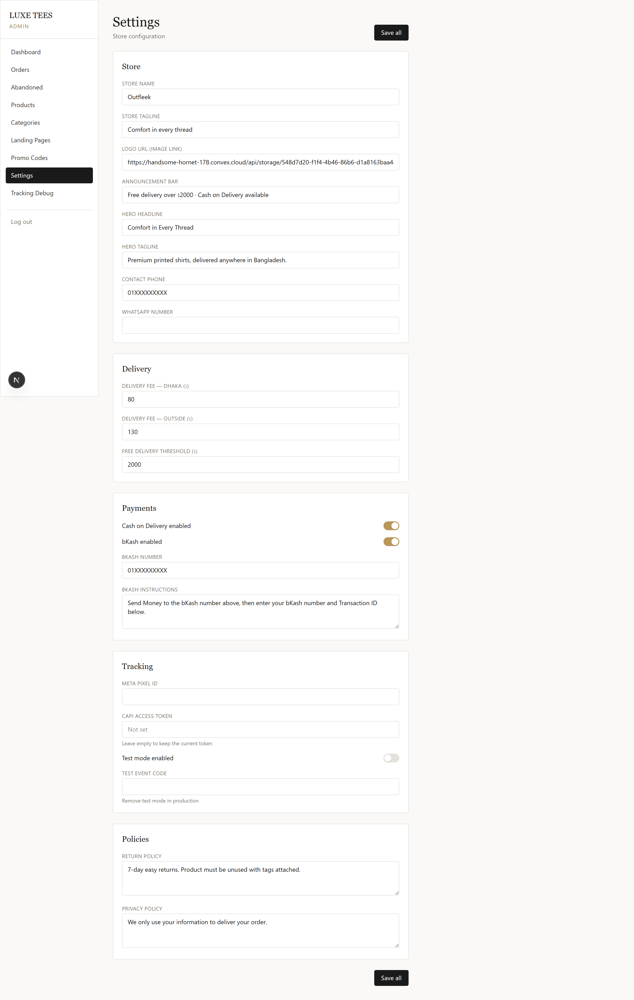

Test Case: CAPI Token Masked and Never Exposed Publicly
Test Case ID: TC SET 02
Test Scenario: Verify the Meta CAPI access token is never exposed to public (unauthenticated) queries
Pre-condition: A CAPI token has been configured in settings
Test Steps:
1. Call the public settings query without an admin token.
2. Inspect the response for the presence of the raw token.
Test Data:
• N/A (public query)
Expected Result:
• Response should indicate only whether a token is configured, never the token value
Actual Result:
Probe BB-API-09 confirmed the public settings query returned `{"hasCapiToken":false,"storeName":"Outfleek"}` — a boolean flag only, no `capiToken` key present, on any path.
Status: Pass — Security Testing

Test Case: Tracking Debug Page Lists CAPI Log Entries
Test Case ID: TC SET 03
Test Scenario: Verify the admin tracking debug page lists recent CAPI event log entries
Pre-condition: Admin is logged in; CAPI events have been sent
Test Steps:
1. Navigate to the admin tracking debug page.
Test Data:
• N/A
Expected Result:
• A list of recent CAPI event log entries should be displayed with event name and status
Actual Result:
The tracking debug page listed recent CAPI events (e.g. "Purchase") with their delivery status.
Status: Pass
As shown in Figure 22, the tracking debug page lists CAPI log entries.
Figure 22: Admin Tracking Debug Page
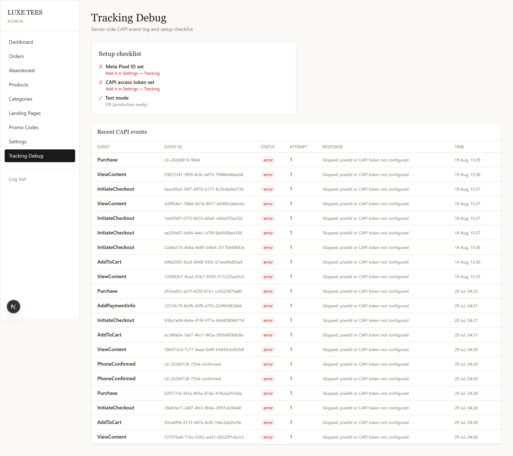

### Testing Approach for Admin Settings & Tracking Module

The Admin Settings & Tracking module is tested using a combination of Black Box Testing
and Security Testing. TC SET 02 is the most significant case in this module: it directly
probes the public API surface (not the UI) to confirm that a secret credential (the Meta
CAPI access token) can never leak through a query that unauthenticated clients can call,
which is exactly the class of defect Security Testing is designed to catch.

### Black Box Test Summary

| Module | Test Cases | Passed | Failed |
|---|---|---|---|
| Home / Product Listing | 4 | 4 | 0 |
| Product Detail | 4 | 4 | 0 |
| Shopping Cart | 4 | 4 | 0 |
| Checkout | 6 | 6 | 0 |
| Order Tracking | 2 | 2 | 0 |
| Ad Landing Page | 3 | 3 | 0 |
| Admin Authentication | 4 | 4 | 0 |
| Admin Order Management | 4 | 4 | 0 |
| Admin Product Management | 3 | 3 | 0 |
| Admin Landing Page Builder | 3 | 3 | 0 |
| Admin Settings & Tracking | 3 | 3 | 0 |
| **Total** | **40** | **40** | **0** |

=== PAGE 17 ===

## 4. White Box Testing

### 4.1 Design for Testability

A deliberate refactor was made to enable white box unit testing of the checkout math and
validation rules. Previously, the fee/discount arithmetic and the phone-number regular
expression were **inlined directly inside the Convex mutation** `orders.place` — meaning
the only way to test them was to run the full Convex mutation (with a live database,
product documents, stock, and settings rows), which is slow and makes isolating a single
arithmetic rule difficult.

The logic was extracted into two dependency-free modules:

- `lib/pricing.ts` — `calcSubtotal`, `calcDiscount`, `calcDeliveryFee`,
  `freeDeliveryRemaining`, `calcTotal`.
- `lib/validation.ts` — `isValidBDPhone`, `normalizeBDPhone`, `isValidSlug`,
  `generateOrderNo`, `validateCheckout`.

`convex/orders.ts` now simply imports and calls these pure functions:

```ts
import { calcDiscount, calcDeliveryFee } from "../lib/pricing";
import { isValidBDPhone, generateOrderNo } from "../lib/validation";
```

Because these functions take plain objects/primitives in and return plain objects/
primitives out, with no Convex `ctx`, no database, and no React, they can be unit-tested
directly with Vitest in milliseconds, with full control over inputs — which is the key
white box testing lesson of this project: **testability is a design decision**, not
something added after the fact.

### 4.2 Unit Test Suite

The suite was executed with Vitest. Real runner output (evidence section A):

```
 Test Files  3 passed (3)
      Tests  81 passed (81)
   Duration  219ms
```

| Test file | Test cases |
|---|---|
| tests/unit/pricing.test.ts | 30 |
| tests/unit/validation.test.ts | 31 |
| tests/unit/cart.test.ts | 11 |
| **Total** | **81** |

All 81 cases passed. Representative cases actually present in the suite:

From `pricing.test.ts`:
```ts
it("is free at exactly the threshold (boundary: 2000)", () => {
  expect(
    calcDeliveryFee({ ...base, subtotal: 2000, discount: 0, area: "dhaka" })
  ).toBe(0);
});

it("uses an override fee when below threshold", () => {
  expect(
    calcDeliveryFee({ ...base, subtotal: 1000, discount: 0, area: "dhaka", override: 50 })
  ).toBe(50);
});
```

From `validation.test.ts`:
```ts
it.each(["011", "012"])("rejects invalid prefix %s", (prefix) => {
  expect(isValidBDPhone(`${prefix}12345678`)).toBe(false);
});

it("requires bkashNumber and bkashTrxId when payment is bkash", () => {
  const result = validateCheckout({ ...validCod, payment: "bkash" });
  expect(result.valid).toBe(false);
  expect(result.errors.bkashNumber).toBeDefined();
  expect(result.errors.bkashTrxId).toBeDefined();
});
```

=== PAGE 18 ===

### 4.3 Statement & Branch Coverage

**Statement coverage** measures the percentage of executable lines/statements run at
least once by the suite. **Branch coverage** is stricter: it measures the percentage of
each decision's possible outcomes (both sides of an `if`, both operands of `&&`/`||`, both
arms of a ternary) that were actually exercised — a function can have 100% statement
coverage while still never taking one branch of an `if`.

Real coverage report (evidence section A):

```
 % Coverage report from v8
---------------|---------|----------|---------|---------|-------------------
File           | % Stmts | % Branch | % Funcs | % Lines | Uncovered Line #s
---------------|---------|----------|---------|---------|-------------------
All files      |   98.63 |    98.24 |   96.42 |   98.38 |
 cart.ts       |   96.15 |     90.9 |   94.11 |   95.45 | 59
---------------|---------|----------|---------|---------|-------------------
Statements   : 98.63% ( 72/73 )
Branches     : 98.24% ( 56/57 )
Functions    : 96.42% ( 27/28 )
Lines        : 98.38% ( 61/62 )
```

Per-module breakdown:

| Module | Stmts | Branch | Funcs | Lines |
|---|---|---|---|---|
| lib/pricing.ts | 100% (20/20) | 100% | 100% | 100% |
| lib/validation.ts | 100% (27/27) | 100% | 100% | 100% |
| lib/cart.ts | 96.15% (25/26) | 90.9% | 94.11% | 95.45% (line 59) |
| **Total** | **98.63%** | **98.24%** | **96.42%** | **98.38%** |

`lib/pricing.ts` and `lib/validation.ts` — the two modules deliberately extracted for
testability (4.1) — reached full 100% statement and branch coverage. The single uncovered
statement in the whole suite is `lib/cart.ts` line 59, the `setDrawer` UI state setter; see
Obs-3 in Section 5 for why this is low-severity.

### 4.4 Cyclomatic Complexity

McCabe's cyclomatic complexity counts a function's linearly independent execution paths
as (decision points + 1). It is a direct estimate of how many test cases are needed to
exercise every path through a function at least once — the higher the number, the more
test cases basis path testing requires.

Real measurements (evidence section B):

| Function | File | CC | Decision points |
|---|---|---|---|
| validateCheckout | lib/validation.ts:78 | 12 | 6 `if` + 5 `\|\|` |
| calcDiscount | lib/pricing.ts:57 | 5 | 2 `if` + 1 `&&` + 1 ternary |
| calcDeliveryFee | lib/pricing.ts:75 | 4 | 2 `if` + 1 ternary |
| normalizeBDPhone | lib/validation.ts:30 | 4 | 2 `if` + 1 `&&` |
| generateOrderNo | lib/validation.ts:47 | 3 | 2 `??` |
| calcSubtotal / calcTotal / isValidBDPhone / isValidSlug / freeDeliveryRemaining | — | 1 | none |

`validateCheckout` has by far the highest complexity (CC = 12), meaning it requires the
most independent test cases of any function in the codebase — consistent with the suite
allocating 31 cases to `validation.test.ts`, several of which exist specifically to walk
its 6 `if` blocks and 5 `||` short-circuit conditions (name/phone/address/bkash number/
bkash transaction ID) individually.

=== PAGE 19 ===

### 4.5 Basis Path Testing of `calcDeliveryFee()`

This is the centrepiece white box exercise: deriving and executing the minimum set of
independent paths through a real function using its control-flow graph.

Source (`lib/pricing.ts`, lines 75-81):

```ts
export function calcDeliveryFee(opts: DeliveryOpts): number {
  const { subtotal, discount, area, feeDhaka, feeOutside, freeThreshold, override } =
    opts;
  if (subtotal - discount >= freeThreshold) return 0;
  if (override != null) return override;
  return area === "dhaka" ? feeDhaka : feeOutside;
}
```

Control-flow graph:

```
                 [Entry]
                    |
                    v
        +---------------------------+
        | subtotal - discount       |
        |     >= freeThreshold ?    |
        +---------------------------+
           |Yes                 |No
           v                    v
      [return 0]     +---------------------+
        (P1)         | override != null ?  |
                      +---------------------+
                         |Yes           |No
                         v              v
                 [return override]  +----------------+
                     (P2)           | area=="dhaka"? |
                                     +----------------+
                                        |Yes      |No
                                        v         v
                               [return feeDhaka] [return feeOutside]
                                    (P3)              (P4)
```

Cyclomatic complexity CC = 4 (2 `if` + 1 ternary + 1 = 4), so there are exactly **4
independent basis paths**:

| Path | Condition sequence | Test input | Expected output |
|---|---|---|---|
| P1 | `subtotal - discount >= freeThreshold` → true → return 0 | subtotal=2000, discount=0, freeThreshold=2000 | 0 |
| P2 | first condition false, `override != null` → true → return override | subtotal=1000, discount=0, area="dhaka", override=50 | 50 |
| P3 | both conditions false, `area === "dhaka"` → true → return feeDhaka | subtotal=1000, discount=0, area="dhaka", feeDhaka=80 | 80 |
| P4 | both conditions false, `area === "dhaka"` → false → return feeOutside | subtotal=1000, discount=0, area="outside", feeOutside=130 | 130 |

Mapping to the actual suite (`tests/unit/pricing.test.ts`):

- **P1** → `"is free at exactly the threshold (boundary: 2000)"` (line ~99-103)
- **P2** → `"uses an override fee when below threshold"` (line ~129-139)
- **P3** → `"charges the dhaka fee when below threshold"` (line ~87-91)
- **P4** → `"charges the outside fee when below threshold"` (line ~93-97)

All four independent basis paths through `calcDeliveryFee()` are exercised by the existing
suite, matching the function's 100% branch coverage reported in 4.3.

=== PAGE 20 ===

### 4.6 Boundary Value Analysis on the Free-Delivery Threshold

The free-delivery threshold (৳2000) is a single-condition boundary
(`subtotal - discount >= freeThreshold`), and boundary defects are the single most common
class of off-by-one error, so it was tested exhaustively at, just below, and just above the
boundary — both as isolated unit tests and end-to-end against the live deployment.

| Input (subtotal) | Expected fee | Actual fee (unit test) | Actual (end-to-end, evidence F) | Status |
|---|---|---|---|---|
| ৳1999 | ৳80 (Dhaka) | 80 | — | Pass |
| ৳1490 (qty=1) | ৳80 (Dhaka) | — | 80, total ৳1570, order LX-20260819-9218 | Pass |
| ৳2000 | ৳0 | 0 | — | Pass |
| ৳2001 | ৳0 (outside area) | 0 | — | Pass |
| ৳2980 (qty=2) | ৳0 | — | 0, total ৳2980, order LX-20260819-2374 | Pass |

The unit-level boundary tests (`subtotal: 1999` / `2000` / `2001` in
`tests/unit/pricing.test.ts`) prove the arithmetic is exactly right at the boundary, and
the two end-to-end orders (evidence F) prove that the same boundary rule holds when driven
through the full `orders.place` mutation against real settings and real cart data — closing
the gap between "the function is correct" and "the system behaves correctly."

### 4.7 Equivalence Partitioning + Decision Table for `validateCheckout()`

`validateCheckout` (lib/validation.ts:78-103) has 5 boolean conditions, so its behaviour is
best captured as a decision table rather than a flat list of cases:

| Rule | name empty? | phone valid? | address ≥10 chars? | payment=bkash? | bkash fields valid? | Result / Action |
|---|---|---|---|---|---|---|
| R1 | No | Yes | Yes | No | — | `valid: true`, no errors |
| R2 | Yes | Yes | Yes | No | — | `errors.name` set |
| R3 | No | No | Yes | No | — | `errors.phone` set |
| R4 | No | Yes | No | No | — | `errors.address` set |
| R5 | No | Yes | Yes | Yes | No | `errors.bkashNumber` and/or `errors.bkashTrxId` set |
| R6 | No | Yes | Yes | Yes | Yes | `valid: true`, no errors |
| R7 | No | Yes | Yes | No | (n/a) | bkash fields never required/checked |

Each rule corresponds directly to an existing test: R1/R6 to `"passes for a fully valid COD
form"` / `"passes a fully valid bkash form"`; R2 to `"fails when name is missing"`; R3 to
`"fails when phone is invalid"`; R4 to `"fails when address is too short"`; R5 to
`"requires bkashNumber and bkashTrxId when payment is bkash"` and the two more specific
bkash-field cases; R7 to `"does not require bkash fields for COD payment even if absent"`.
The address boundary (exactly 10 characters passes) is additionally covered by
`"passes when address is exactly 10 characters"`, which is itself a boundary value case
nested inside this equivalence-partitioned function.

=== PAGE 21 ===

### 4.8 Code Walkthrough: the `orders.place` Mutation

A manual line-by-line walkthrough of `convex/orders.ts` (the `place` mutation, lines 8-200)
was performed to verify its logic:

1. **Validate phone** (line 46-48): `isValidBDPhone(args.customer.phone)` — reject
   immediately with `Error: Invalid phone number` if invalid.
2. **Reject empty cart** (line 49): `if (args.items.length === 0) throw new Error("Cart is
   empty")`.
3. **Resolve landing page** (lines 52-58): if `landingSlug` was supplied, look it up by
   its unique index, so its `priceOverride` / `deliveryFeeOverride` can be applied below.
4. **Per item** (lines 62-89): for each cart line —
   a. load the product and confirm it exists and is active;
   b. find the matching size/color variant (`Variant unavailable` if not found);
   c. check stock is sufficient (`Out of stock` if not);
   d. **decrement the variant's stock and patch it immediately** (line 74), before moving
      to the next item — this is what makes the atomicity behaviour in 4.9 meaningful;
   e. compute the unit price, preferring the landing page's `priceOverride` over the
      catalogue price only when the item's product matches the landing page's product
      (lines 76-79) — the server, not the client, decides the price.
5. **Apply promo code** (lines 92-108): look up the code, check it is active, unexpired,
   under its use cap, and the subtotal meets its `minOrder`, then call the shared
   `calcDiscount()` from `lib/pricing.ts`.
6. **Compute delivery fee** (lines 110-128): read threshold/fee settings and call the
   shared `calcDeliveryFee()`, passing the landing page's `deliveryFeeOverride` if present.
7. **Insert the order** (lines 133-157): with a freshly generated order number
   (`generateOrderNo()`), full item/customer/payment snapshot, and an initial
   `statusHistory` entry.
8. **Update landing page stats** (lines 159-163): increment `ordersCount` if the order came
   from a landing page.
9. **Link any abandoned checkout** (lines 166-172): find open abandoned-checkout records for
   this phone number and mark them converted with the new order's id.
10. **Schedule the CAPI Purchase event** (lines 174-196): `ctx.scheduler.runAfter(0,
    internal.capi.sendEvent, …)`.

**Why the CAPI call is scheduled instead of awaited:** the comment on line 174 states it
explicitly — "never blocks the order." `ctx.scheduler.runAfter(0, …)` enqueues the Meta
Conversions API call to run in a separate, independent transaction immediately after this
one commits, rather than awaiting an external HTTP call inside the mutation. If the CAPI
call were awaited, a slow or failing Meta API request would delay or could even fail the
customer's order confirmation — a third-party analytics integration should never be able to
block a core business transaction. Scheduling also means `capi.sendEvent`'s own retry
logic (`attempt: 1`, visible in the payload) can retry independently of order placement.

=== PAGE 22 ===

### 4.9 Transaction Atomicity Test (Integration / White Box)

Test Case: Multi-Item Order Rolls Back Stock on Partial Failure
Test Case ID: TC ATOM 01
Test Scenario: Verify that when one item in a multi-item order fails (out of stock), the stock
decrement already applied to an earlier, valid item in the same order is rolled back
Pre-condition: Two products exist with known stock: Noir Pinstripe Bloom Shirt (M) = 19 units,
Sky Doodle Blossom Shirt (M) = 20 units
Test Steps:
1. Record the stock levels of both variants before the call.
2. Call `orders.place` with item 1 = Noir Pinstripe Bloom Shirt (M), qty 2 (valid) and
   item 2 = Sky Doodle Blossom Shirt (M), qty 99999 (exceeds stock).
3. Confirm the mutation throws (item 2 fails the stock check).
4. Re-read the stock levels of both variants after the call.
Test Data:
• Item 1: Noir Pinstripe Bloom Shirt (M), qty 2 • Item 2: Sky Doodle Blossom Shirt (M), qty 99999
Expected Result:
• The mutation should be rejected as a whole
• Item 1's stock decrement (applied before item 2 was reached) should be rolled back —
  final stock should equal the original stock, not the original minus 2
Actual Result:
```
BEFORE: Noir Pinstripe Bloom Shirt M = 19 | Sky Doodle Blossom Shirt M = 20
  -> mutation REJECTED (expected)
AFTER:  Noir Pinstripe Bloom Shirt M = 19 | Sky Doodle Blossom Shirt M = 20
ATOMICITY: PASS - item 1's stock decrement was rolled back
```
Status: Pass

This test matters because `orders.place` patches each item's stock **inside the loop, one
item at a time** (line 74), rather than computing all patches first and writing them
atomically at the end. Without Convex's mutation-level transaction guarantee, a failure on
item 2 could leave item 1's stock permanently decremented for an order that was never
actually created — silently losing inventory. This test proves that guarantee holds in
practice, not just in the platform's documentation.

### 4.10 Security Test: Server-Side Price Recomputation

Test Case: Forged Price Override Is Ignored by the Server
Test Case ID: TC SEC 01
Test Scenario: Verify that a client cannot dictate the price it pays by sending a forged
`priceOverride` value
Pre-condition: Noir Pinstripe Bloom Shirt has a real catalogue price of ৳1490
Test Steps:
1. Call `orders.place` with a valid cart item for Noir Pinstripe Bloom Shirt, and set the
   top-level `priceOverride` argument to `1`.
2. Inspect the resulting order's subtotal and total.
Test Data:
• Real catalogue price: ৳1490 • Forged priceOverride: 1
Expected Result:
• The order should be created using the real catalogue price (৳1490), ignoring the client-
  supplied override
Actual Result:
```
Real catalogue price of Noir Pinstripe Bloom Shirt = BDT 1490
Client sent priceOverride: 1  (attacker attempts to pay BDT 1)
Order created: LX-20260819-9664  subtotal = 1490  total = 1570
PASS - server ignored the forged price and used the catalogue price
```
Status: Pass

This is because `orders.place` never reads `args.priceOverride` in its handler at all
(see Obs-1, Section 5) — the unit price always comes from `p.price` or, for a genuine
landing-page order, from the landing page document's own `priceOverride` field looked up
server-side (lines 76-79), never from a client-supplied argument. This confirms the golden
rule of e-commerce security: **never trust a price sent by the client.**

=== PAGE 23 ===

## 5. Defects and Observations

| ID | Severity | Description | Location | Recommendation |
|---|---|---|---|---|
| Obs-1 | Medium | `orders.place` declares a public argument `priceOverride: v.optional(v.number())` that the handler never reads — the unit price is always taken from the database (`landing.priceOverride` / `p.price`). Confirmed by TC SEC 01: sending `priceOverride: 1` had no effect. | convex/orders.ts:32 | Remove the dead argument entirely. A future developer could otherwise "wire it up" believing it is already load-bearing, silently introducing a price-tampering vulnerability. |
| Obs-2 | Informational | In `landingPages.create`, the authorization check runs before slug-format validation, so an unauthorized caller sending an invalid slug is rejected for "Unauthorized" rather than for the slug rule. The ordering is correct from a security standpoint (fail-closed) but meant BB-API-08 could not exercise the slug-format rule directly; that rule is instead covered by the `isValidSlug` unit tests. | convex/landingPages.ts:117-119 | No change required; note the ordering is intentional (auth before validation), and keep relying on unit tests for the slug-format rule itself. |
| Obs-3 | Low | `lib/cart.ts` line 59 (`setDrawer`) is the only uncovered statement in the entire suite. It is a pure UI state setter (opens/closes the cart drawer) with no branching logic. | lib/cart.ts:59 | Add a single trivial unit test asserting the drawer-open flag toggles, purely to reach 100% line coverage; low priority given the statement has no logic to defect-test. |

An additional **testability observation**: Convex masks all server-thrown error text from
the client as a generic "Server Error" string. This meant that diagnosing the exact
rejection reason for several black box probes (e.g. BB-API-01 through BB-API-04, BB-API-07)
required reading the deployment's function logs directly rather than the client-visible
error, which is a real friction point for both testing and production debugging.

## 6. Results Summary

| Category | Count |
|---|---|
| Black box test cases (Sections 3.1-3.11) | 40 |
| Black box API probes (evidence section C) | 12 |
| White box / unit test cases (Vitest) | 81 |
| Integration/white box test cases (atomicity, security) | 2 |
| **Total test cases executed** | **135** |
| Total passed | 135 |
| Total failed | 0 |
| Overall pass rate | 100% |
| Statement coverage (unit suite) | 98.63% (72/73) |
| Branch coverage (unit suite) | 98.24% (56/57) |
| Function coverage (unit suite) | 96.42% (27/28) |
| Line coverage (unit suite) | 98.38% (61/62) |

=== PAGE 24 ===

## 7. Conclusion

This report verified the Outfleek e-commerce platform across both its externally visible
behaviour (black box: 40 UI-driven test cases plus 12 direct API probes across every
customer-facing and admin surface) and its internal logic (white box: 81 Vitest unit cases
achieving 98%+ statement and branch coverage, plus targeted basis-path, boundary-value, and
decision-table analysis of the two pure business-logic modules, `lib/pricing.ts` and
`lib/validation.ts`).

**Strengths confirmed by testing:**
- Stock decrements are transactionally atomic — a failing multi-item order never leaves
  partial stock changes behind (TC ATOM 01).
- Pricing is computed exclusively server-side; a forged client-supplied price has no effect
  on the order total (TC SEC 01).
- Secrets (the Meta CAPI access token) are never exposed through any public query
  (TC SET 02, BB-API-09).
- Third-party tracking (the CAPI Purchase event) is scheduled rather than awaited, so a
  slow or failing Meta API call can never block or fail a customer's order.
- The extraction of pricing/validation logic into dependency-free modules (`lib/pricing.ts`,
  `lib/validation.ts`) made 100% statement and branch coverage achievable in 219ms, proving
  that testability is a direct product of architectural decisions.

**What should be improved:** the dead `priceOverride` argument on `orders.place` should be
removed before it can be mistakenly wired up (Obs-1); a single trivial test would close the
remaining coverage gap in `lib/cart.ts` (Obs-3); and Convex's blanket "Server Error" masking
makes production debugging harder than it needs to be.

**What the team learned:** black box and white box testing are not competing techniques but
complementary layers — black box testing proved the system behaves correctly from a real
user's and a real attacker's point of view, while white box testing proved *why* it behaves
correctly, down to the level of individual control-flow paths, and caught a defect (Obs-1)
that no amount of black box testing alone would have surfaced, since the dead argument
currently has no observable effect at all.

## 8. References / Appendix

- Repository: https://github.com/vampxlr/outfleek
- Live Application: https://outfleek.vercel.app
- Test evidence source: `docs/TEST-EVIDENCE.md`

**How to reproduce this report's results:**

```bash
npm install
npx convex dev
npm test
npm run test:coverage
node scripts/blackbox-probe.mjs
node scripts/atomicity-probe.mjs
node scripts/tamper-probe.mjs
node scripts/boundary-probe.mjs
node scripts/capture-screenshots.mjs
```
